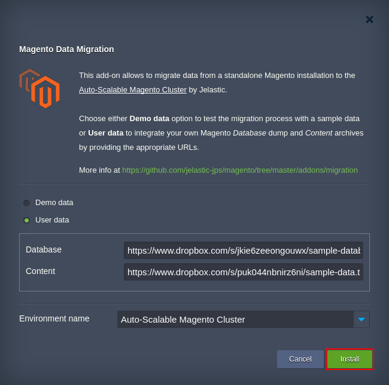
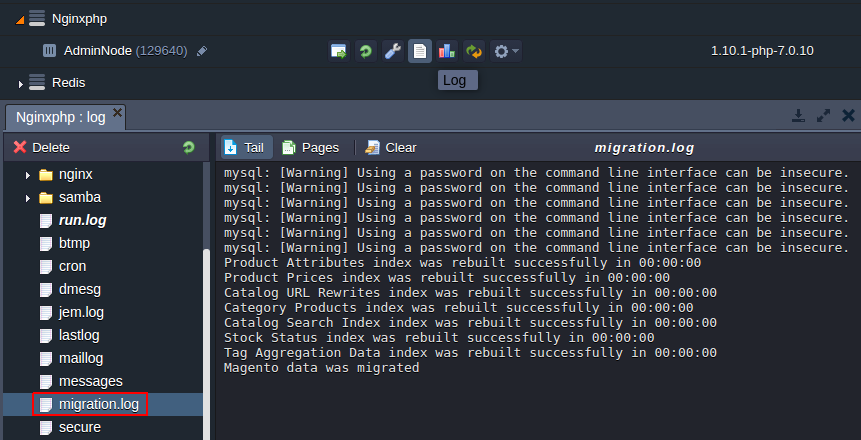

# Magento Data Migration Add-On

The Magento Data Migration add-on is designed to facilitate data migration from a legacy host to [Auto-Scalable Magento Cluster](https://blog.jelastic.com/2017/08/31/auto-scalable-magento-cluster-in-containers/) by Jelastic. Namely, it allows to import content and database dump from the previously used Magento installation to the above mentioned advanced clustered infrastructure and, in such a way, to gain increased productivity and reliability for your service.

Herewith, the Magento Data Migration add-on contains two options:
* _**Demo data**_ - choose it to test importing procedure using a predefined Magento data sample
* _**User data**_ - intended for actual import of your data from the legacy Magento installation of the equal version (currently, only _**1.9.x**_ Magento is supported)

> **Note:** If your Magento installation contains extensive custom configurations, you’ll need to re-apply them manually after migration.

For more information about [Jelastic Add-Ons](https://github.com/jelastic-jps/jpswiki/wiki/Jelastic-Addons) and their usage, refer to the linked guide.

## Prerequisites for Magento Data Migration

In order to import your Magento data from another host to Jelastic, you need to export your Magento database and content into two separate archive files. For that, access the corresponding servers and execute the following operations:
* Within the MySQL/MariaDB server, use the _**[mysqldump](https://dev.mysql.com/doc/refman/5.7/en/mysqldump.html)**_ client utility to produce an SQL dump file and pack it into a TAR.GZ archive.
* Within the application server, access **/var/www/html/magento** (for CentOS-based) or **/var/www/magento** (for Ubuntu-based) folder and compress its content into a single TAR.GZ package.

When both archives are ready, upload them to any online storage system and proceed with the Magento Data Migration add-on installation.

## How to Migrate Magento Data with Add-On

To apply the Magento Data Migration add-on, copy link to the _**manifest.jps**_ file above, access your [Jelastic Platform](https://jelastic.cloud/) and [import](https://docs.jelastic.com/environment-import) the URL. Alternatively, you can locate and install the add-on via [Jelastic Marketplace](https://docs.jelastic.com/marketplace#add-ons).

Within the installation box, select the **User data** option and provide the following information: 
* _**Database**_ - link to a TAR.GZ archive file with Magento database dump
* _**Content**_ - link to a TAR.GZ archive file with Magento content

Select the destination _Environment name_ within the list of available ones and click on **Install**. 

Wait a minute till importing is finished. To get the additional details on its completion, you can check the _**migration.log**_ file on the **Admin Node** (use the **Log** button next to it).

